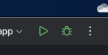

# Desafio Luiza Labs

## Requisitos

- Docker: 25.0.3 (ou superior)
- Docker Compose: 2.3.3 (ou superior)
- NodeJS: 18.17.1
- npm: 9.6.7

## Executando com o Android Studio

Para preparar o ambiente para dar início a execução do aplicativo, primeiro é preciso fazer o clone
do projeto que está no repositório `https://github.com/roqlsilva/luiza-labs.git`.

Feito isso, abra o projeto com o Android Studio. Quando finalizar o download das dependências e o sincronismo
do projeto, Aperte o botão `Run` que fica localizado na parte superior direita do Android Studio, conforme a imagem a seguir.

